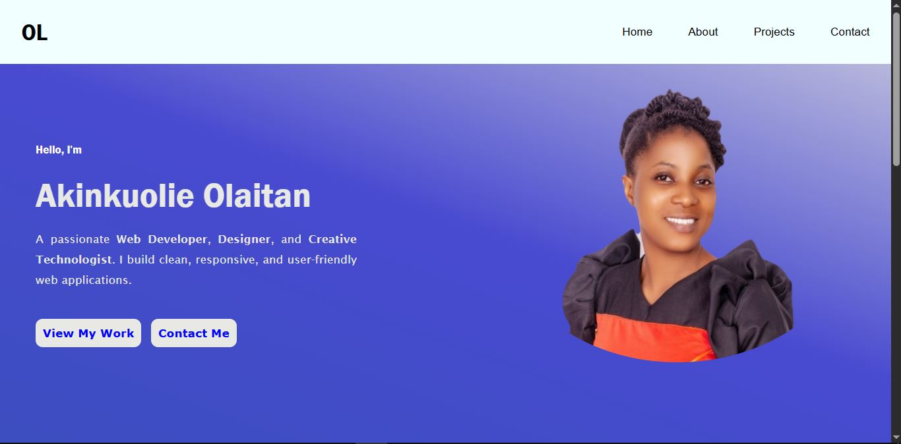

# Personal Portfolio Website

## Table of Contents
- [Project Overview](#project-overview)
- [Features](#features)
- [Project Structure](#project-structure)
- [Technologies Used](#technologies-used)
- [Getting Started](#getting-started)
- [Usage](#usage)
- [Screenshots](#screenshots)
- [Deployment](#deployment)
- [Contributing](#contributing)
- [License](#license)
- [Contact](#contact)

---

## Project Overview
This is a personal portfolio website designed to showcase projects, skills, and contact information. The site is fully responsive, visually appealing, and easy to navigate. It is built using only HTML, CSS, and JavaScript, making it lightweight and fast.

## Features
- **Home Page:** Introduction and profile picture.
- **About Page:** Detailed information about me, skills, and background.
- **Projects Page:** Gallery of completed projects with images and descriptions.
- **Contact Page:** Contact form and social media links.
- **Responsive Design:** Works seamlessly on desktops, tablets, and mobile devices.
- **Modern UI:** Clean and professional layout with custom CSS styling.
- **Image Gallery:** Project images and profile pictures.
- **Interactive Elements:** JavaScript-powered features for enhanced user experience.

## Project Structure
```
├── about.html
├── contact.html
├── index.html
├── projects.html
├── README.md
├── css/
│   ├── about.css
│   ├── contact.css
│   ├── index.css
│   └── projects.css
├── images/
│   ├── conference ticket generator.JPG
│   ├── Focusmte app.JPG
│   ├── Food app.JPG
│   ├── Olaitan Akinkuolier.jpg
│   ├── Olaitan.jpg
│   ├── profile-pic.png
│   ├── Prsonal-Portfolio.JPG
│   └── vitagard image.JPG
└── js/
    └── main.js
```

## Technologies Used
- **HTML5**: Structure and content
- **CSS3**: Styling and layout
- **JavaScript (ES6+)**: Interactivity and DOM manipulation

## Getting Started

### Prerequisites
- A modern web browser (Chrome, Firefox, Edge, Safari)
- No installation required; all files are static

### Running Locally
1. **Clone the repository:**
   ```sh
   git clone <repository-url>
   ```
2. **Navigate to the project directory:**
   ```sh
   cd <project-folder>
   ```
3. **Open `index.html` in your browser:**
   - Double-click `index.html` or right-click and select "Open with" your browser.

## Usage
- **Navigate** between pages using the navigation bar.
- **View projects** on the Projects page with images and descriptions.
- **Contact** the developer via the Contact page form or social links.

## Screenshots
> Add screenshots of your website here for better visualization.

- 
- 

## Deployment
You can deploy this website using any static hosting service, such as:
- [GitHub Pages](https://pages.github.com/)
- [Netlify](https://www.netlify.com/)
- [Vercel](https://vercel.com/)
- [Firebase Hosting](https://firebase.google.com/products/hosting)

### Steps for GitHub Pages
1. Push your code to a GitHub repository.
2. Go to the repository settings.
3. Enable GitHub Pages from the "Pages" section.
4. Select the branch (usually `main`) and root folder.
5. Your site will be live at `https://<username>.github.io/<repository-name>/`.

## Contributing
Contributions are welcome! To contribute:
1. Fork the repository.
2. Create a new branch (`git checkout -b feature/your-feature`)
3. Commit your changes (`git commit -m 'Add some feature'`)
4. Push to the branch (`git push origin feature/your-feature`)
5. Open a Pull Request

## License
This project is open source and available under the [MIT License](LICENSE).

## Contact
- **Developer:** Olaitan Akinkuolie
- **Email:** [your-email@example.com]
- **LinkedIn:** [your-linkedin-profile]
- **GitHub:** [your-github-profile]

Feel free to reach out for feedback, questions, or collaboration opportunities!
